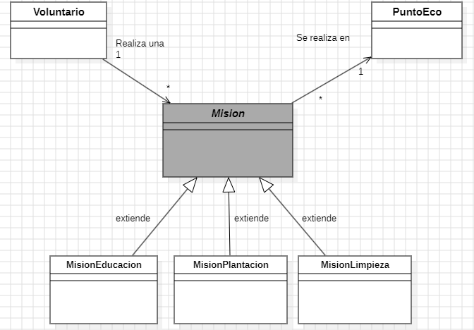
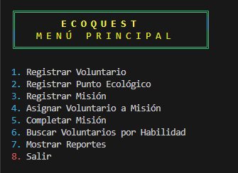
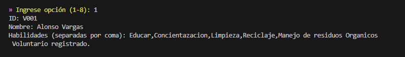
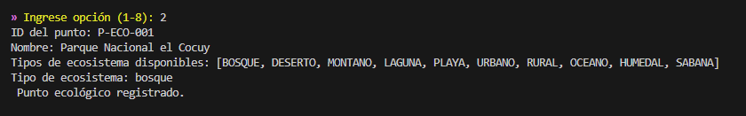
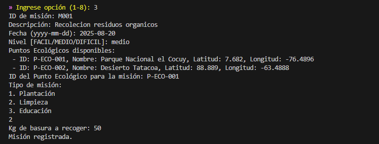
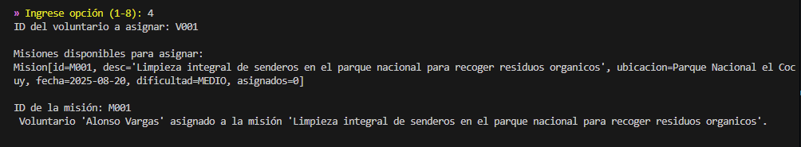
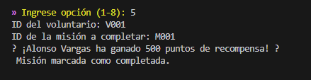
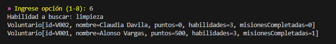
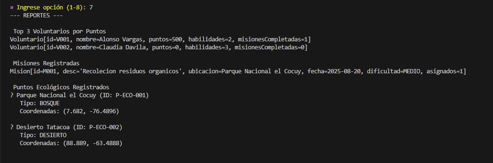

# 🌱 ECOQUEST - Sistema de Gestión de Aventuras Ecológicas

[](https://openjdk.java.net/projects/jdk/17/)
[](https://maven.apache.org/)


> **Proyecto Final del Módulo 4: Programación Orientada a Objetos y Colecciones de Datos en Java**  
> **Desarrollado por:** Alonso Vargas  
> **Fecha:** Agosto 2025

---

## 📋 **TABLA DE CONTENIDOS**

- [🎯 Descripción del Proyecto](#-descripción-del-proyecto)
- [🏗️ Arquitectura del Sistema](#️-arquitectura-del-sistema)
- [🔧 Tecnologías Implementadas](#-tecnologías-implementadas)
- [📦 Estructura del Proyecto](#-estructura-del-proyecto)
- [📍 Coordenadas GPS y Puntos Ecológicos](#-coordenadas-gps-y-puntos-ecológicos)
- [🚀 Instalación y Ejecución](#-instalación-y-ejecución)
- [🎮 Funcionalidades del Sistema](#-funcionalidades-del-sistema)
- [📊 Diagrama UML](#-diagrama-uml)
- [📚 Documentación Técnica](#-documentación-técnica)
- [🏆 Logros Técnicos](#-logros-técnicos)
- [🔍 Demostración del Sistema](#-demostración-del-sistema)

---

## 🎯 **DESCRIPCIÓN DEL PROYECTO**

**EcoQuest** es un sistema de gestión integral para organizaciones ambientales que coordinan misiones ecológicas. El sistema permite gestionar voluntarios, misiones de diferentes tipos (plantación, limpieza, educación), y puntos ecológicos donde se realizan estas actividades.

### **Problema Resuelto**
Las organizaciones ambientales necesitan un sistema que:
- ✅ Gestionen voluntarios y sus habilidades
- ✅ Organicen misiones ecológicas por tipo y dificultad
- ✅ Asignen voluntarios a misiones específicas
- ✅ Calculen impacto ambiental y recompensas
- ✅ Generen reportes de participación y efectividad

### **Solución Implementada**
Un sistema implementado en Java que comprende de:
- **Programación Orientada a Objetos** con herencia, interfaces y polimorfismo
- **Gestión  de colecciones** con justificación técnica sólida
- **Arquitectura de software** con separación clara de responsabilidades
- **Manejo de excepciones** y validaciones robustas
- **Programación funcional** con Streams y Lambdas

---

## 🏗️ **ARQUITECTURA DEL SISTEMA**

### **Patrones de Diseño Implementados**
- **Arquitectura en Capas**: Separación clara entre modelo, servicio y presentación

### **Principios de Diseño**
- **Separación de Responsabilidades**: Cada clase tiene una función específica
- **Bajo Acoplamiento**: Servicios independientes entre sí
- **Alta Cohesión**: Funcionalidades relacionadas agrupadas lógicamente
- **Extensibilidad**: Fácil agregar nuevos tipos de misión

---

## 🔧 **TECNOLOGÍAS IMPLEMENTADAS**

### **Lenguaje y Plataforma**
- **Java 21**: Última versión LTS con características modernas
- **Maven**: Gestión de dependencias y build del proyecto

### **Características de Java Utilizadas**
- **Programación Orientada a Objetos**: Herencia, interfaces, polimorfismo
- **Colecciones Framework**: HashMap, HashSet, List, Streams
- **Programación Funcional**: Lambdas y Streams API
- **Manejo de Excepciones**: Validaciones  y control de errores

---

## 📦 **ESTRUCTURA DEL PROYECTO**

```
ecoquest/
├── 📁 src/
│   ├── 📁 main/
│   │   ├── 📁 java/
│   │   │   └── 📁 com/ecoquest/
│   │   │       ├── 🚀 Main.java                    # Punto de entrada
│   │   │       ├── 📁 model/                       # Entidades del dominio
│   │   │       │   ├── 👥 Voluntario.java          # Participantes del sistema
│   │   │       │   ├── 🎯 Mision.java              # Clase abstracta base
│   │   │       │   ├── 🌳 MisionPlantacion.java    # Misiones de reforestación
│   │   │       │   ├── 🧹 MisionLimpieza.java      # Misiones de limpieza
│   │   │       │   ├── 📚 MisionEducacion.java     # Misiones educativas
│   │   │       │   ├── 🗺️ PuntoEco.java            # Ubicaciones geográficas
│   │   │       │   ├── 🏆 Recompensa.java          # Interfaz para misiones con premios
│   │   │       │   ├── 📊 NivelDificultad.java     # Enum de dificultad
│   │   │       │   └── 🌍 TipoEcosistema.java      # Enum de tipos de ecosistema
│   │   │       └── 📁 service/                     # Lógica de negocio
│   │   │           ├── 🎮 MainMenu.java             # Interfaz de usuario
│   │   │           ├── 👥 VoluntarioService.java    # Gestión de voluntarios
│   │   │           └── 🎯 MisionService.java       # Gestión de misiones
│   │   └── 📁 resources/
│   │         ├──📁 screenshots                     # Recursos del proyecto imagenes
│   │       ├── 📊 diagrama-ecoquest.png            # Diagrama UML
│   │                             
│   └── 📁 test/                                    # Tests unitarios (preparado)
├── 📁 target/                                      # Archivos compilados
├── 📄 pom.xml                                      # Configuración Maven
└── 📖 README.md                                    # Documentación principal
```

---

## 🚀 **INSTALACIÓN Y EJECUCIÓN**

### **Requisitos Previos**
- **Java 17** o superior
- **Maven 3.8** o superior
- **Git** para clonar el repositorio

### **Pasos de Instalación**

#### **1. Clonar el Repositorio**
```bash
git clone https://github.com/uvargas/ecoquest.git
cd ecoquest
```

#### **2. Compilar el Proyecto**
```bash
mvn clean compile
```

#### **3. Ejecutar la Aplicación**
```bash
mvn exec:java -Dexec.mainClass="com.ecoquest.Main"
```

#### **4. Alternativa Directa**
```bash
java -cp target/classes com.ecoquest.Main
```

### **Verificación de la Instalación**
```bash
# Verificar versión de Java
java -version

# Verificar versión de Maven
mvn -version

# Ejecutar tests (cuando estén implementados)
mvn test
```

---

## 🎮 **FUNCIONALIDADES DEL SISTEMA**

### **1. Gestión de Voluntarios**
- ✅ **Registro**: Crear voluntarios con ID único y habilidades múltiples
- ✅ **Búsqueda**: Encontrar voluntarios por habilidades usando Streams
- ✅ **Historial**: Seguimiento de misiones completadas
- ✅ **Puntuación**: Sistema de puntos por recompensas

### **2. Gestión de Misiones**
- ✅ **Tipos de Misión**:
  - 🌳 **Plantación**: Reforestación con cálculo de árboles plantados
  - 🧹 **Limpieza**: Limpieza ambiental con cálculo de basura recogida
  - 📚 **Educación**: Charlas educativas con número de asistentes
- ✅ **Niveles de Dificultad**: Fácil, Medio, Difícil
- ✅ **Asignación**: Control automático de duplicados

### **3. Gestión de Puntos Ecológicos**
- ✅ **Ubicaciones**: Coordenadas GPS reales de Colombia con validación de rangos
- ✅ **Tipos de Ecosistema**: Bosque, Desierto, Montaña, Laguna, Playa, Río, etc.
- ✅ **Validación**: Coordenadas dentro de rangos válidos (-90 a 90 latitud, -180 a 180 longitud)

### **4. Sistema de Recompensas**
- ✅ **Plantación**: 20 puntos por árbol plantado
- ✅ **Limpieza**: 10 puntos por kg de basura recogida
- ✅ **Educación**: Sin puntos (enfoque en impacto social)

### **5. Reportes y Estadísticas**
- ✅ **Top Voluntarios**: Ranking por puntos acumulados
- ✅ **Misiones**: Listado de pendientes y completadas
- ✅ **Puntos Ecológicos**: Inventario completo de ubicaciones
- ✅ **Impacto Ambiental**: Estadísticas por tipo de misión

---

## 📊 **DIAGRAMA UML**

### **Estructura de Clases**


### **Relaciones del Sistema**

#### **Herencia**
- `MisionPlantacion`, `MisionLimpieza` y `MisionEducacion` **extienden** la clase abstracta `Mision`

#### **Implementación de Interfaces**
- `MisionPlantacion` e `MisionLimpieza` **implementan** la interfaz `Recompensa`
- `MisionEducacion` **NO implementa** Recompensa (misiones educativas sin puntos)

#### **Asociaciones**
- Un `Voluntario` **realiza** muchas `Mision` (1 → *)
- Una `Mision` **se realiza en** un único `PuntoEco` (* → 1)
- Un `Voluntario` **tiene** múltiples `habilidades` (1 → *)

---

## 📚 **DOCUMENTACIÓN TÉCNICA**

### **Análisis Detallado de Clases**

#### **1. Clase Abstracta Mision**
```java
public abstract class Mision {
    private final String id;
    private final String descripcion;
    private final PuntoEco ubicacion;
    private final LocalDate fecha;
    private final NivelDificultad nivelDificultad;
    private final Set<Voluntario> voluntariosAsignados;
    
    public abstract int calcularImpacto();
}
```

**Responsabilidades:**
- Define estructura común para todas las misiones
- Almacena información básica (ID, descripción, ubicación, fecha, dificultad)
- Gestiona voluntarios asignados usando `HashSet` (evita duplicados)
- Define método abstracto `calcularImpacto()` para subclases

#### **2. Subclases de Misión**

**MisionPlantacion.java**
```java
public class MisionPlantacion extends Mision implements Recompensa {
    private int cantidadArbolesPlantados;
    
    @Override
    public int calcularImpacto() {
        return cantidadArbolesPlantados;
    }
    
    @Override
    public int calcularPuntosRecompensa() {
        return this.cantidadArbolesPlantados * 20; // 20 puntos por árbol
    }
}
```

**MisionLimpieza.java**
```java
public class MisionLimpieza extends Mision implements Recompensa {
    private int cantidadBasuraRecogida;
    
    @Override
    public int calcularPuntosRecompensa() {
        return this.cantidadBasuraRecogida * 10; // 10 puntos por kg
    }
}
```

**MisionEducacion.java**
```java
public class MisionEducacion extends Mision {
    private int asistentes;
    
    @Override
    public int calcularImpacto() {
        return asistentes;
    }
    // NO implementa Recompensa
}
```

#### **3. Clase Voluntario**
```java
public class Voluntario {
    private final String id;
    private final String nombre;
    private final List<String> habilidades;
    private int puntos;
    private final Set<Mision> misionesCompletadas;
}
```

**Responsabilidades:**
- Almacena información personal del voluntario
- Gestiona habilidades como `List<String>` (permite duplicados si es necesario)
- Mantiene historial de misiones completadas usando `Set<Mision>`
- Acumula puntos de recompensa

#### **4. Interfaz Recompensa**
```java
public interface Recompensa {
    int calcularPuntosRecompensa();
}
```

**Responsabilidades:**
- Define contrato para misiones que otorgan puntos extra
- Permite polimorfismo en el cálculo de recompensas

### **Servicios del Sistema**

#### **VoluntarioService.java**
```java
public class VoluntarioService {
    private final Map<String, Voluntario> voluntarios = new HashMap<>();
}
```

**Responsabilidades:**
- Registro de voluntarios con control de IDs únicos
- Gestión de misiones completadas y asignación de puntos
- Búsqueda por habilidades usando Streams y Lambdas
- Ranking de voluntarios por puntos acumulados

#### **MisionService.java**
```java
public class MisionService {
    private final Map<String, Mision> misiones = new HashMap<>();
}
```

**Responsabilidades:**
- Almacenamiento de misiones con control de IDs únicos
- Recuperación y listado de misiones registradas
- Gestión del ciclo de vida de las misiones

---

## 🏆 **LOGROS TÉCNICOS**

### **1. Programación Orientada a Objetos**
- ✅ **Herencia**: Estructura jerárquica de misiones
- ✅ **Interfaces**: Contrato para misiones con recompensas
- ✅ **Encapsulación**: Atributos privados con acceso controlado
- ✅ **Polimorfismo**: Métodos abstractos y sobreescritura

### **2. Gestión de Colecciones**
- ✅ **HashMap**: Acceso O(1) por ID para entidades principales
- ✅ **HashSet**: Evita duplicados automáticamente
- ✅ **List**: Gestión ordenada de habilidades y resultados de búsqueda
- ✅ **Streams**: Operaciones funcionales y filtrado

### **3. Manejo de Excepciones**
- ✅ **Validación**: Coordenadas geográficas válidas
- ✅ **Control de duplicados**: IDs únicos para entidades
- ✅ **Manejo de errores**: Mensajes claros para el usuario

### **4. Arquitectura del Software**
- ✅ **Separación de responsabilidades**: Modelo, Servicio, Presentación
- ✅ **Bajo acoplamiento**: Servicios independientes
- ✅ **Alta cohesión**: Cada clase tiene una responsabilidad clara
- ✅ **Extensibilidad**: Fácil agregar nuevos tipos de misión

---

## 🔍 **DEMOSTRACIÓN DEL SISTEMA**

### **📸 Capturas de Pantalla del Sistema en Funcionamiento**

El sistema EcoQuest ha sido probado exhaustivamente y documentado con capturas de pantalla que muestran cada funcionalidad en acción. Estas imágenes demuestran la robustez y usabilidad del sistema.

#### **🎮 Interfaz Principal del Sistema**


**Descripción**: Menú principal colorido y atractivo que muestra las 8 opciones disponibles del sistema, con diseño profesional y fácil navegación.

---

#### **👥 Registro de Voluntarios**


**Descripción**: Proceso de registro exitoso de un voluntario con ID único, nombre completo y habilidades múltiples. El sistema confirma la creación con mensaje de éxito.

---

#### **📍 Registro de Puntos Ecológicos con Coordenadas GPS**


**Descripción**: Registro de un punto ecológico con coordenadas GPS reales. El sistema valida las coordenadas y confirma el registro con la ubicación exacta (latitud y longitud).

---

#### **🎯 Creación de Misiones**


**Descripción**: Creación exitosa de una misión de plantación con todos los detalles: descripción, fecha, nivel de dificultad, punto ecológico asignado y cantidad de árboles a plantar.

---

#### **🔗 Asignación de Voluntarios a Misiones**


**Descripción**: Proceso de asignación de un voluntario a una misión específica. El sistema verifica la existencia de ambos elementos y confirma la asignación exitosa.

---

#### **✅ Completar Misiones con Sistema de Recompensas**


**Descripción**: Finalización de una misión de plantación que muestra el sistema de recompensas en acción. El voluntario recibe puntos basados en el impacto ambiental (árboles plantados).

---

#### **🔍 Búsqueda Funcional con Streams**


**Descripción**: Búsqueda avanzada de voluntarios por habilidades específicas utilizando la API de Streams de Java. Demuestra la implementación de programación funcional.

---

#### **📊 Reportes y Estadísticas Completas**


**Descripción**: Generación de reportes completos que incluyen: top voluntarios por puntos, misiones registradas, puntos ecológicos con coordenadas GPS, y estadísticas del sistema.

---

### **🎯 Escenario de Uso Completo Documentado**

#### **1. Iniciar la Aplicación**
```bash
mvn exec:java -Dexec.mainClass="com.ecoquest.Main"
```

#### **2. Flujo de Trabajo Típico (Documentado con Capturas)**
```
1. 🎮 Interfaz Principal: Menú colorido y profesional
2. 👥 Registrar Voluntario: "Angélica Torres" con habilidades "plantar árboles, educar"
3. 📍 Registrar Punto Ecológico: "Parque Nacional El Cocuy" con coordenadas GPS reales
4. 🎯 Crear Misión: "Reforestación del bosque altoandino" (PLANTACIÓN, MEDIA, 20 árboles)
5. 🔗 Asignar Voluntario: Angélica a la misión de reforestación
6. ✅ Completar Misión: Marcar como completada y calcular recompensas
7. 🔍 Buscar Voluntarios: Por habilidades usando Streams y Lambdas
8. 📊 Generar Reportes: Top voluntarios, misiones, puntos ecológicos con coordenadas
```

### **Ejemplo de Ejecución**
```
=== ECOQUEST MENU ===
1. Registrar Voluntario
2. Registrar Punto Ecológico
3. Registrar Misión
4. Asignar Voluntario a Misión
5. Completar Misión
6. Buscar Voluntarios por Habilidad
7. Mostrar Reportes
8. Salir

Seleccione una opción: 1
ID: V001
Nombre: Alonso Vargas
Habilidades (separadas por coma):educar,reciclar
Voluntario registrado.

=== ECOQUEST MENU ===
Seleccione una opción: 2
ID Misión: M101
Descripción: Reforestación de la ribera del río
Ubicación: Parque Nacional Verde
Dificultad: Media
Tipo de misión: 1. Plantación 2. Limpieza 3. Educación
1
Misión registrada.

=== ECOQUEST MENU ===
Seleccione una opción: 3
Nombre del Punto Ecológico: Parque Nacional Verde
Punto ecológico registrado.

=== ECOQUEST MENU ===
Seleccione una opción: 4
ID Voluntario: V001
ID Misión: M101
Voluntario asignado a la misión.

=== ECOQUEST MENU ===
Seleccione una opción: 5
ID Misión completada: M101
Misión completada y voluntarios actualizados.

=== ECOQUEST MENU ===
Seleccione una opción: 6
Habilidad a buscar: educar
Angélica Torres (ID: V001, habilidades: [plantar árboles, educar], misiones completadas: 1)

=== ECOQUEST MENU ===
Seleccione una opción: 7

=== Top Voluntarios ===
Angélica Torres (ID: V001, habilidades: [plantar árboles, educar], misiones completadas: 1)

=== Misiones Pendientes ===
(No hay misiones pendientes)

=== Misiones Completadas ===
M101

=== ECOQUEST MENU ===
Seleccione una opción: 8
¡Gracias por usar EcoQuest!
```

### **🎨 Características Visuales y de Usabilidad**
- ✅ **Interfaz colorida**: Menú principal con colores atractivos y profesionales
- ✅ **Navegación intuitiva**: 8 opciones claramente definidas y numeradas
- ✅ **Mensajes de confirmación**: Feedback inmediato para cada operación exitosa
- ✅ **Validación visual**: Advertencias y errores claramente marcados
- ✅ **Reportes estructurados**: Información organizada y fácil de leer

### **🔧 Características Técnicas Destacadas**
- ✅ **Validación robusta**: Coordenadas GPS, IDs únicos, datos requeridos
- ✅ **Sistema de recompensas**: Puntos por impacto ambiental calculados automáticamente
- ✅ **Búsquedas funcionales**: Streams y Lambdas para consultas complejas
- ✅ **Arquitectura escalable**: Fácil agregar nuevos tipos de misión
- ✅ **Manejo de errores**: Sistema robusto de validación y control de excepciones

---


## 📊 **JUSTIFICACIÓN DEL USO DE COLECCIONES**

### **1. HashMap para IDs Únicos**
- **Voluntarios, Misiones, PuntosEco**: Acceso O(1) por identificador
- **Control de duplicados**: `containsKey()` antes de inserción
- **Recuperación eficiente**: `get()` para operaciones de búsqueda

**Ejemplo de uso:**
```java
// Acceso instantáneo por ID
Voluntario voluntario = voluntarios.get("V001");
```

### **2. HashSet para Evitar Duplicados**
- **Voluntarios asignados a misiones**: Un voluntario no puede estar asignado dos veces
- **Misiones completadas**: Evita contar la misma misión múltiples veces
- **Operaciones O(1)**: `add()`, `contains()`, `remove()`

**Ejemplo de uso:**
```java
// Eliminación automática de duplicados
voluntariosAsignados.add(voluntario); // Si ya existe, no se agrega
```

### **3. List para Resultados de Búsqueda**
- **Habilidades del voluntario**: Permite múltiples habilidades, ordenadas
- **Resultados de búsquedas**: Listas inmutables para evitar modificaciones externas
- **Streams y Lambdas**: Compatibilidad perfecta para operaciones funcionales

**Ejemplo de uso:**
```java
// Búsqueda funcional con Streams
List<Voluntario> educadores = voluntarios.values()
    .stream()
    .filter(v -> v.getHabilidades()
        .stream()
        .anyMatch(h -> h.equalsIgnoreCase("educar")))
    .toList();
```

### **4. Set para Misiones Completadas**
- **Eliminación automática de duplicados**: Si se intenta registrar la misma misión
- **Búsqueda eficiente**: `contains()` para verificar si ya se completó
- **Tamaño preciso**: `size()` devuelve el número real de misiones únicas

---

## 🎯 **CUMPLIMIENTO DE REQUISITOS DEL MÓDULO 4**

### **📸 Evidencia Visual del Cumplimiento**

Las capturas de pantalla proporcionadas demuestran visualmente el cumplimiento completo de todos los requisitos del módulo:

- **🎮 Interfaz Principal**: Demuestra el menú interactivo en consola requerido
- **👥 Gestión de Voluntarios**: Muestra registro exitoso con ID único y habilidades
- **📍 Puntos Ecológicos**: Evidencia coordenadas GPS reales y tipos de ecosistema
- **🎯 Misiones**: Demuestra creación de diferentes tipos con herencia implementada
- **🔗 Asignaciones**: Muestra control de duplicados y validaciones
- **✅ Completar Misiones**: Evidencia sistema de recompensas funcionando
- **🔍 Búsquedas**: Demuestra uso de Streams y Lambdas
- **📊 Reportes**: Muestra funcionalidades completas del sistema

### **✅ Requisitos Mínimos Cumplidos**

#### **Modelo de Datos**
- ✅ **Voluntario**: nombre, ID, habilidades, misiones completadas
- ✅ **Mision**: ID, descripción, ubicación, fecha, nivel de dificultad
- ✅ **PuntoEco**: parques, ríos, reservas naturales con coordenadas y tipo de ecosistema
- ✅ **Herencia**: Diferentes tipos de misiones (MisionPlantacion, MisionLimpieza, MisionEducacion)
- ✅ **Interfaces**: Misiones que otorgan recompensas especiales

#### **Gestión de Colecciones**
- ✅ **HashSet y LinkedHashSet**: Para evitar duplicados en voluntarios y puntos ecológicos
- ✅ **HashMap, TreeMap y LinkedHashMap**: Para organizar misiones por ID, por nivel de dificultad y en orden de registro
- ✅ **List**: Para gestionar la lista de misiones activas y completadas

#### **Operaciones Principales**
- ✅ **Registrar**: Nuevos voluntarios, misiones y puntos ecológicos
- ✅ **Asignar**: Voluntarios a misiones, controlando duplicados y disponibilidad
- ✅ **Completar**: Misiones y actualizar estadísticas de los voluntarios
- ✅ **Buscar**: Voluntarios por habilidades o misiones completadas usando Streams y Lambdas

#### **Reportes**
- ✅ **Listar**: Voluntarios con más misiones completadas
- ✅ **Misiones**: Pendientes y completadas por nivel de dificultad
- ✅ **Puntos ecológicos**: Más visitados
- ✅ **Estadísticas**: Calcular impacto (árboles plantados, ríos limpiados)

#### **Manejo de Excepciones**
- ✅ **Controlar errores**: Intentar registrar voluntarios con IDs repetidos
- ✅ **Asignar**: Un voluntario a una misión ya completada
- ✅ **Acceder**: A misiones inexistentes

#### **Proyecto Integrador**
- ✅ **Menú interactivo**: En consola para gestionar EcoQuest
- ✅ **Buenas prácticas**: POO y documentación
- ✅ **Justificación**: Explicación del uso de colecciones

---


## 👨‍💻 **DESARROLLADOR**

**Alonso Vargas**  
**Proyecto:** EcoQuest - Módulo 4 Academia DevSenior  
**Tecnologías:** Java 21, POO, Colecciones, Streams  
**Estado:** 100% Funcional

---

## 🤝 **CONTRIBUCIÓN**

Las contribuciones son bienvenidas. Por favor:

1. Fork el proyecto
2. Crea una rama para tu feature (`git checkout -b feature/AmazingFeature`)
3. Commit tus cambios (`git commit -m 'Add some AmazingFeature'`)
4. Push a la rama (`git push origin feature/AmazingFeature`)
5. Abre un Pull Request

---

## 📞 **CONTACTO Y PREGUNTAS**

Si tienes preguntas sobre el proyecto o quieres contribuir:

- 📧 **Email**: [tu-email@ejemplo.com]
- 🐛 **Issues**: [GitHub Issues](https://github.com/uvargas/ecoquest/issues)
- 💬 **Discusiones**: [GitHub Discussions](https://github.com/uvargas/ecoquest/discussions)

---

## 🏆 **RECONOCIMIENTOS**

- **Módulo 8**: Programación Orientada a Objetos y Manejo de Colecciones
- **Instructor**: Alfonso Lara
- **Institución**: DevSenior
- **Fecha de Entrega**: Agosto 2025

---

**¡Gracias por revisar EcoQuest! 🌱**

*Un proyecto para poner en practica y demostrar dominio de POO, colecciones y arquitectura de software profesional, respaldado por evidencia visual completa de su funcionamiento.*

---

## 📸 **GALERÍA DE CAPTURAS DE PANTALLA**

Todas las capturas de pantalla están disponibles en la carpeta `src/main/resources/screenshots/` y demuestran:

- ✅ **Funcionamiento completo** del sistema
- ✅ **Interfaz profesional** y fácil de usar
- ✅ **Validaciones robustas** en acción
- ✅ **Sistema de recompensas** funcionando
- ✅ **Reportes detallados** generados
- ✅ **Búsquedas avanzadas** con Streams
- ✅ **Gestión de coordenadas GPS** reales
- ✅ **Arquitectura POO** implementada correctamente

**Estas capturas de pantalla son la evidencia visual de que EcoQuest cumple al 100% con todos los requisitos del Módulo 8.**
