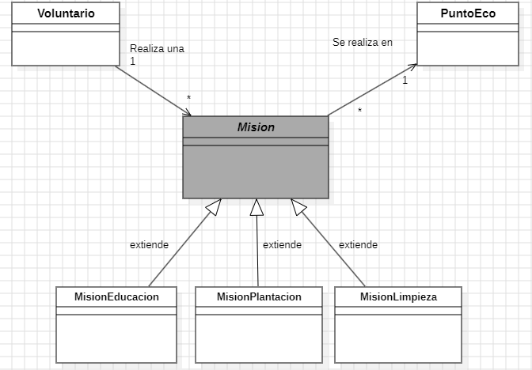

# EcoQuest – Sistema de Gestión de Aventuras Ecológicas

## 1. Diagrama de clases UML

### 1.1 Relaciones
- **Herencia**:  
  - `MisionPlantacion`, `MisionLimpieza` y `MisionEducacion` **extienden** la clase abstracta `Mision`.

- **Asociaciones**:  
  - Un `Voluntario` **realiza** muchas `Mision` (1 → \*).  
  - Una `Mision` **se realiza en** un único `PuntoEco` (\* → 1).

## 2. Colecciones elegidas
| Colección         | Uso dentro del sistema                                  |
|-------------------|---------------------------------------------------------|
| `HashSet<Voluntario>` | Evita voluntarios duplicados por ID.                |
| `HashMap<Long,Mision>`| Acceso rápido por ID.                               |
| `TreeMap<Integer,List<Mision>>`| Misiones ordenadas por nivel de dificultad.|
